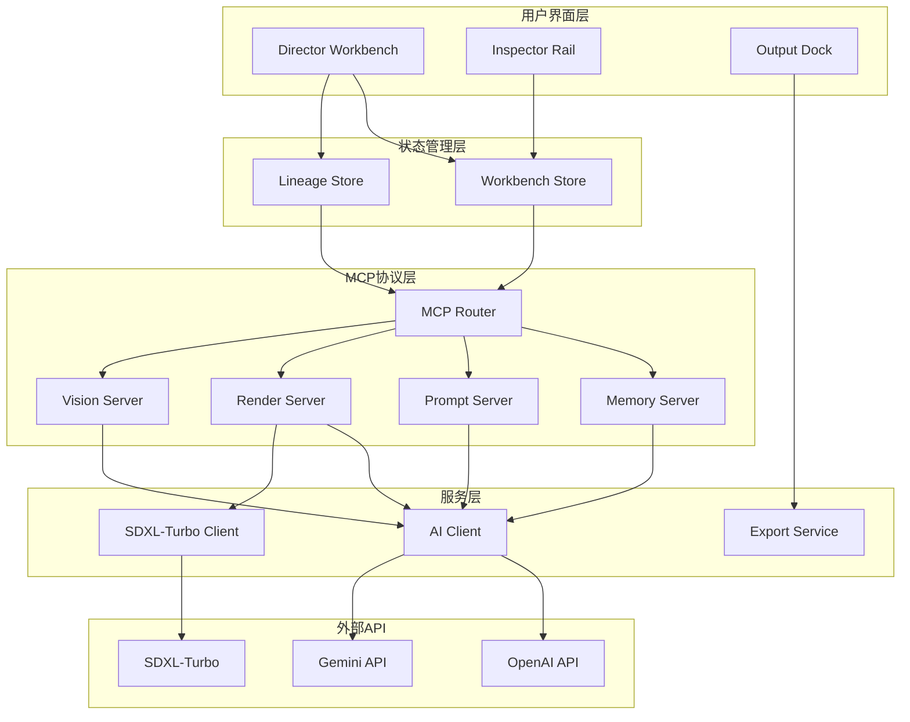
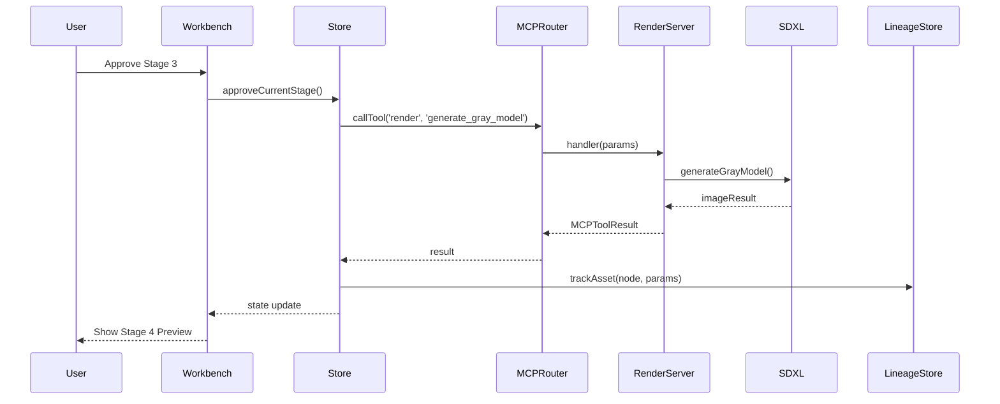

## 产品概述

智能分镜制片台是一个工业级影视分镜生产系统，需要补全横向工业化支撑能力，实现完整的五步工业管线，支持多格式导出，并重构为MCP Server协议架构。

## 核心功能

### 第一优先级：横向工业化支撑

- **资产血缘追踪系统**：建立DAG图追踪每张图片的生成来源、参数依赖和版本历史
- **变更传导机制**：支持局部重绘和增量更新，避免全量回退
- **元数据归档**：存储Seed、LoRA、Prompt历史等关键生产参数

### 第二优先级：Stage 4灰模预演

- **SDXL-Turbo集成**：低算力快速生成灰模/线稿预览
- **ControlNet约束**：基于景深和结构的一致性控制
- **预演审批流程**：支持灰模的审批/驳回机制

### 第三优先级：导出功能

- **PDF分镜剧本集**：带图片的分镜PDF文档
- **CSV场表/器材清单**：供现场摄制组使用的数据表
- **JSON资产归档包**：完整元数据和资产包

### 第四优先级：MCP Server架构

- **标准化协议接口**：重构为MCP Server架构
- **工具注册机制**：支持第三方工具接入
- **向后兼容**：保持现有功能不受影响

## 技术栈选择

- **前端框架**：React 19 + TypeScript + Vite（延续现有技术栈）
- **状态管理**：Zustand（现有方案，扩展资产追踪能力）
- **UI组件库**：shadcn/ui + Radix UI（现有方案）
- **样式方案**：Tailwind CSS v4（现有方案）
- **PDF生成**：jsPDF + html2canvas（新增依赖）
- **图表可视化**：React Flow（用于DAG血缘图）
- **AI接口**：OpenAI API + Gemini（现有）+ SDXL-Turbo（新增）

## 实现方案

### 一、资产血缘追踪系统

#### 1.1 数据模型扩展

在 `src/types.ts` 中新增资产血缘相关类型：

```typescript
// 资产节点：代表一个可追踪的生产资产
interface AssetNode {
  id: string
  type: 'character_image' | 'scene_image' | 'shot_image' | 'gray_model'
  sourceStage: StageId
  generatedAt: Date
  version: number
  locked: boolean
}

// 生成参数快照
interface GenerationParams {
  seed?: number
  prompt: string
  negativePrompt?: string
  model: string
  aspectRatio: ImageAspectRatio
  imageSize: ImageSize
  loraIds?: string[]
  controlNetSettings?: ControlNetConfig
  temperature?: number
}

// 血缘边：代表依赖关系
interface LineageEdge {
  id: string
  sourceId: string
  targetId: string
  relationType: 'derived_from' | 'consistency_locked' | 'parameter_inherited'
  createdAt: Date
}
```

#### 1.2 DAG血缘图存储

在 `src/store/lineage-store.ts` 中实现血缘追踪Store：

```typescript
interface LineageState {
  nodes: Map<string, AssetNode>
  edges: LineageEdge[]
  
  // 追踪操作
  trackAsset: (node: AssetNode, params: GenerationParams) => void
  addDependency: (sourceId: string, targetId: string, type: LineageEdge['relationType']) => void
  
  // 查询操作
  getAncestors: (assetId: string) => AssetNode[]
  getDescendants: (assetId: string) => AssetNode[]
  getLineageChain: (assetId: string) => LineageChain
  
  // 影响分析
  analyzeChangeImpact: (assetId: string) => ImpactReport
}
```

#### 1.3 变更传导机制

实现增量更新和爆炸半径控制：

```typescript
interface ChangePropagationService {
  // 分析修改某资产后需要重新生成的下游资产
  analyzePropagation: (changedAssetId: string) => AffectedAssets
  
  // 局部重绘：只重新生成受影响的资产
  propagateChange: (changedAssetId: string) => Promise<void>
  
  // 爆炸半径控制：限制级联更新范围
  containsBlastRadius: (maxDepth: number) => void
}
```

### 二、Stage 4灰模预演

#### 2.1 SDXL-Turbo集成

在 `src/services/sdxl-client.ts` 中实现SDXL-Turbo客户端：

```typescript
interface SDXLConfig {
  baseUrl: string
  apiKey: string
  model: 'sdxl-turbo' | 'sdxl-lightning'
  defaultSteps: number // 1-4步，极低算力
}

export async function generateGrayModel(
  shotSpec: ShotSpec,
  options: { style: 'sketch' | 'grayscale' | 'wireframe' }
): Promise<GrayModelResult>
```

#### 2.2 ControlNet约束集成

为保持一致性，引入ControlNet结构约束：

```typescript
interface ControlNetConfig {
  type: 'depth' | 'canny' | 'openpose' | 'scribble'
  strength: number // 0.0 - 1.0
  preprocessor: string
}
```

#### 2.3 Stage 4编排逻辑

在 `src/services/orchestrator.ts` 中新增：

```typescript
const STAGE4_SYSTEM_PROMPT = `你是一位影视预演专家，服务于工业级分镜制片管线。

你的任务：根据ShotSpec生成用于灰模预演的提示词，要求：
1. 保持构图和景别参数
2. 简化为轮廓/线稿风格
3. 标注关键光源方向
4. 不涉及材质细节

输出格式：纯文本提示词，用于SDXL-Turbo生成。`

export async function orchestrateStage4(
  shotSpec: ShotSpec,
  bible: ProjectBible
): Promise<GrayModelPrompt>
```

### 三、导出功能

#### 3.1 PDF分镜剧本集

使用jsPDF + html2canvas生成带图片的PDF：

```typescript
interface PDFExportService {
  generateStoryboardPDF: (shots: ShotWithImage[], bible: ProjectBible) => Promise<Blob>
  // 布局：每页2-4个镜头，包含图、镜号、描述、参数
}
```

#### 3.2 CSV场表导出

生成供摄制组使用的数据表：

```typescript
interface CSVExportService {
  generateSceneList: (shots: ShotSpec[]) => string
  generateEquipmentList: (shots: ShotSpec[], characters: CharacterDesign[]) => string
  // 字段：镜号、场景、角色、焦段、景别、特殊设备等
}
```

#### 3.3 JSON资产归档包

完整元数据归档：

```typescript
interface ArchivePackage {
  version: string
  exportedAt: Date
  projectBible: ProjectBible
  expandedScript: string
  characters: CharacterDesign[]
  scenes: SceneDesign[]
  shotSpecs: ShotSpec[]
  lineage: LineageGraph
  generationHistory: GenerationParams[]
  assets: AssetManifest
}
```

### 四、MCP Server架构重构

#### 4.1 MCP协议接口定义

参考 `docs/v3_mcp_cognitive_architecture.md` 的设计：

```typescript
// MCP Server标准接口
interface MCPServer {
  name: string
  description: string
  tools: MCPTool[]
  resources?: MCPResource[]
  prompts?: MCPPrompt[]
}

interface MCPTool {
  name: string
  description: string
  inputSchema: JSONSchema
  handler: (params: unknown) => Promise<MCPToolResult>
}

// 工具返回结果
interface MCPToolResult {
  content: Array<{
    type: 'text' | 'image' | 'resource'
    text?: string
    data?: string
    mimeType?: string
  }>
  isError?: boolean
}
```

#### 4.2 四大Server实现

按照V3架构设计，实现四个独立Server：

**Memory Server（记忆与剧本）**

```typescript
const memoryServer: MCPServer = {
  name: 'memory',
  tools: [
    { name: 'get_project_bible', handler: getProjectBible },
    { name: 'get_expanded_script', handler: getExpandedScript },
    { name: 'get_character_blueprint', handler: getCharacterBlueprint },
    { name: 'update_subject_state', handler: updateSubjectState }
  ]
}
```

**Prompt Server（提示词工程）**

```typescript
const promptServer: MCPServer = {
  name: 'prompt',
  tools: [
    { name: 'build_stage1_prompt', handler: buildStage1Prompt },
    { name: 'build_stage3_prompt', handler: buildStage3Prompt },
    { name: 'refine_shot_description', handler: refineShotDescription }
  ]
}
```

**Render Server（渲染与合成）**

```typescript
const renderServer: MCPServer = {
  name: 'render',
  tools: [
    { name: 'generate_concept_image', handler: generateConceptImage },
    { name: 'generate_gray_model', handler: generateGrayModel },
    { name: 'generate_final_shot', handler: generateFinalShot }
  ]
}
```

**Vision Server（一致性校验）**

```typescript
const visionServer: MCPServer = {
  name: 'vision',
  tools: [
    { name: 'verify_character_consistency', handler: verifyCharacterConsistency },
    { name: 'verify_scene_consistency', handler: verifySceneConsistency },
    { name: 'check_shot_continuity', handler: checkShotContinuity }
  ]
}
```

#### 4.3 MCP Router

实现统一路由和调用分发：

```typescript
class MCPRouter {
  private servers: Map<string, MCPServer>
  
  registerServer(server: MCPServer): void
  callTool(serverName: string, toolName: string, params: unknown): Promise<MCPToolResult>
  listTools(): MCPTool[]
}
```

#### 4.4 向后兼容适配层

保持现有API不变：

```typescript
// 现有orchestrator函数保持可用
export async function orchestrateStage1(...) {
  // 内部转发到MCP Router
  return mcpRouter.callTool('memory', 'build_stage1_prompt', params)
}
```

## 架构设计

### 系统架构图



### 数据流图



## 目录结构

```
d:\Gitres\storyboard-app\
├── src/
│   ├── types/
│   │   ├── index.ts                    # [MODIFY] 扩展资产血缘类型定义
│   │   ├── lineage.ts                  # [NEW] 血缘追踪类型定义
│   │   ├── mcp.ts                      # [NEW] MCP协议类型定义
│   │   └── export.ts                   # [NEW] 导出相关类型定义
│   │
│   ├── store/
│   │   ├── workbench-store.ts          # [MODIFY] 扩展Stage 4/5逻辑
│   │   └── lineage-store.ts            # [NEW] 资产血缘状态管理
│   │
│   ├── services/
│   │   ├── orchestrator.ts             # [MODIFY] 新增Stage 4/5编排逻辑
│   │   ├── ai-client.ts               # [KEEP] 现有AI客户端
│   │   ├── sdxl-client.ts             # [NEW] SDXL-Turbo客户端
│   │   ├── change-propagation.ts       # [NEW] 变更传导服务
│   │   ├── export/
│   │   │   ├── pdf-export.ts          # [NEW] PDF导出服务
│   │   │   ├── csv-export.ts          # [NEW] CSV导出服务
│   │   │   └── json-export.ts         # [NEW] JSON归档服务
│   │   └── mcp/
│   │       ├── router.ts              # [NEW] MCP路由器
│   │       ├── memory-server.ts       # [NEW] 记忆Server
│   │       ├── prompt-server.ts       # [NEW] 提示词Server
│   │       ├── render-server.ts       # [NEW] 渲染Server
│   │       └── vision-server.ts       # [NEW] 视觉Server
│   │
│   ├── components/
│   │   ├── workbench/
│   │   │   ├── director-workbench.tsx # [MODIFY] 扩展Stage 4/5工作区
│   │   │   └── output-dock.tsx        # [MODIFY] 添加导出按钮
│   │   ├── lineage/
│   │   │   ├── lineage-graph.tsx      # [NEW] DAG血缘图组件
│   │   │   └── impact-panel.tsx       # [NEW] 变更影响分析面板
│   │   └── export/
│   │       └── export-dialog.tsx      # [NEW] 导出对话框组件
│   │
│   └── utils/
│       ├── dag-utils.ts               # [NEW] DAG图算法工具
│       └── schema-validators.ts       # [NEW] JSON Schema验证器
│
├── package.json                        # [MODIFY] 添加新依赖
└── vite.config.ts                      # [KEEP] 现有配置
```

## 关键实现细节

### 1. 资产生成时自动追踪

在 `workbench-store.ts` 的 `runImageGenAI` 中集成追踪：

```typescript
const result = await generateDesignImage(...)

// 自动创建资产节点
const assetNode: AssetNode = {
  id: `asset-${crypto.randomUUID()}`,
  type: type === 'character' ? 'character_image' : 'scene_image',
  sourceStage: 2,
  generatedAt: new Date(),
  version: 1,
  locked: false
}

const params: GenerationParams = {
  prompt: prompt,
  model: 'gemini-3.1-flash',
  aspectRatio: imageSettings.aspectRatio,
  imageSize: imageSettings.imageSize,
  seed: result.seed // 如果API返回
}

getLineageStore().trackAsset(assetNode, params)
```

### 2. Stage 4灰模生成的血缘链接

```typescript
// 在生成灰模时建立依赖关系
const grayModelAsset: AssetNode = {
  id: `gray-${shotId}`,
  type: 'gray_model',
  sourceStage: 4,
  ...
}

// 建立与ShotSpec的依赖
getLineageStore().addDependency(
  shotSpec.id,           // ShotSpec作为源
  grayModelAsset.id,     // 灰模作为目标
  'derived_from'
)
```

### 3. 变更影响分析

```typescript
// 当修改角色描述时，分析受影响的资产
const impact = getLineageStore().analyzeChangeImpact(characterId)

// impact包含：
// - 直接依赖的图片
// - 间接依赖的分镜灰模
// - 爆炸半径建议（重绘数量）
```

### 4. MCP调用示例

```typescript
// 传统方式（保持兼容）
const result = await orchestrateStage1(bible, script)

// MCP方式（新标准）
const result = await mcpRouter.callTool('memory', 'build_stage1_prompt', {
  bible,
  rawScript: script
})
```

## 性能考虑

### 1. 血缘图查询优化

- 使用邻接表存储DAG结构
- 缓存常用查询路径（如"获取所有后代节点"）
- 增量更新而非全量重建

### 2. PDF生成优化

- 分页渲染，避免一次性加载所有图片
- 图片压缩到合适分辨率（打印质量即可）
- 使用Web Worker处理生成过程

### 3. MCP调用优化

- 批量工具调用合并
- 结果缓存机制
- 并行调用无依赖的Server

## 测试策略

### 单元测试

- 血缘图算法测试（祖先查询、后代查询、循环检测）
- MCP工具调用测试
- 导出格式验证测试

### 集成测试

- Stage 0-5完整流程测试
- 变更传导流程测试
- 导出功能端到端测试

### 性能测试

- 大规模血缘图查询性能
- 并发MCP调用性能
- PDF生成内存占用

## Agent Extensions

### SubAgent

- **code-explorer**
- Purpose: 在实现过程中探索现有代码模式和依赖关系
- Expected outcome: 确保新代码与现有架构保持一致，避免破坏性修改