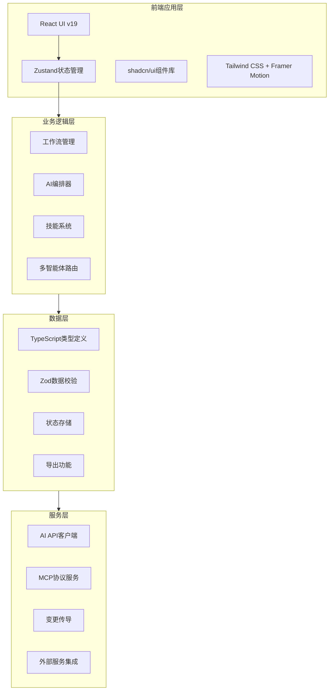
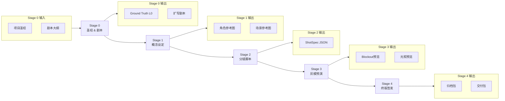
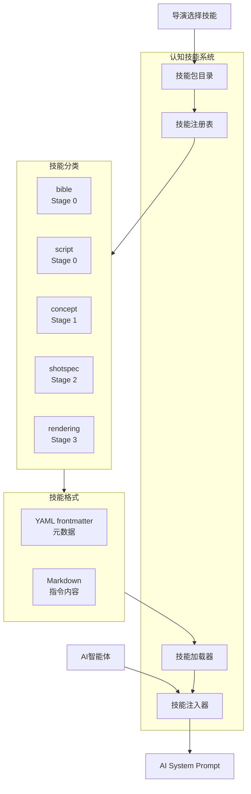
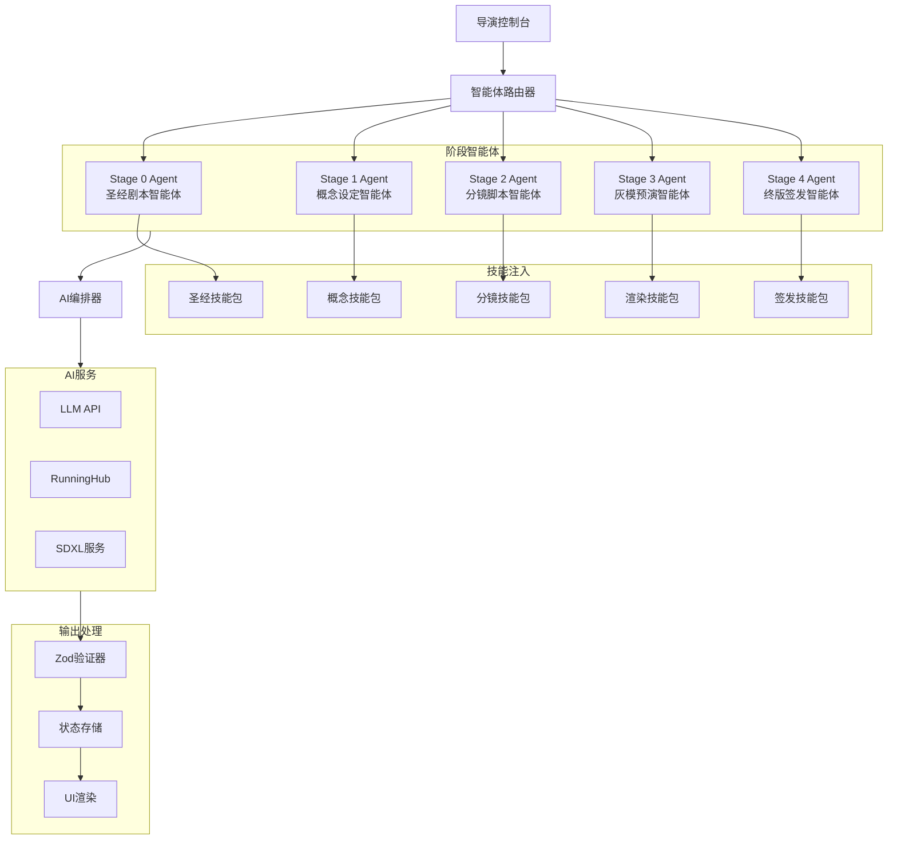
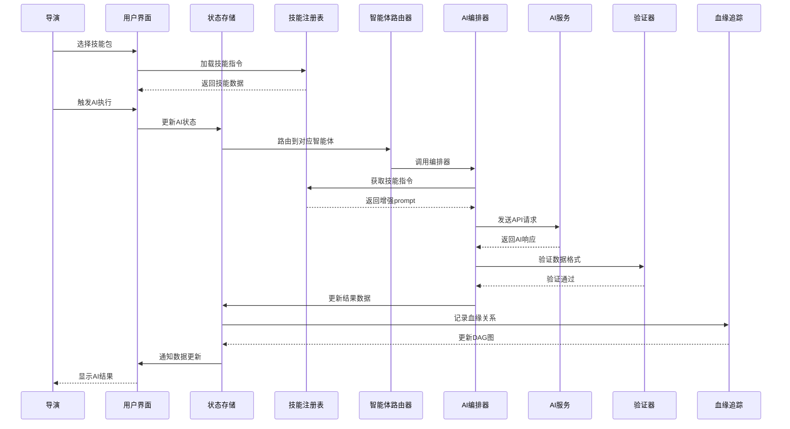
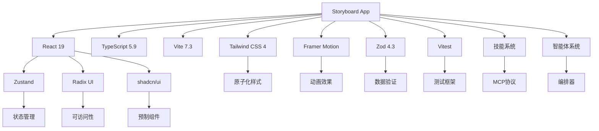
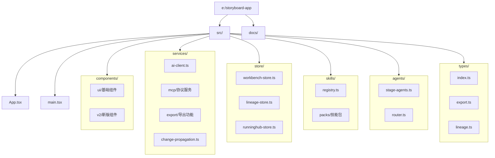
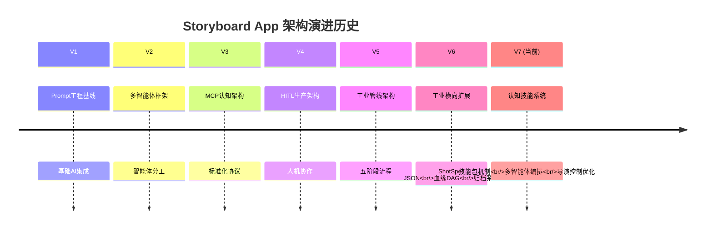
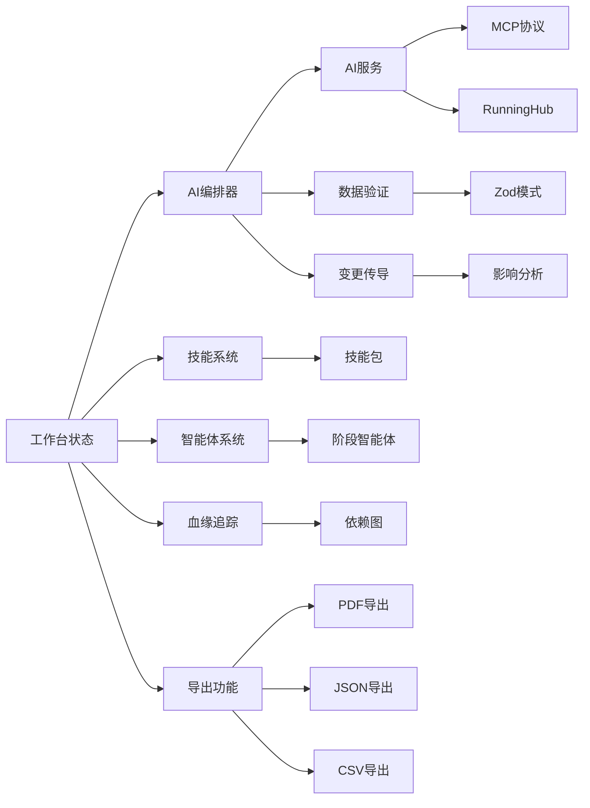

# Storyboard App 架构图

## 整体架构图

## 五阶段工作流图

## 认知技能系统架构

## 多智能体编排架构

## 数据流架构

## 技术栈依赖图

## 文件结构图

## 架构演进历史图

## 核心模块关系图

---

## 图表说明

### 1. 整体架构图
展示了项目的四层架构：
- **前端应用层**: React UI和状态管理
- **业务逻辑层**: 工作流、AI编排、技能系统
- **数据层**: 类型定义、数据验证、状态存储
- **服务层**: AI API、MCP协议、外部服务

### 2. 五阶段工作流图
展示了影视分镜的完整制作流程：
- Stage 0: 项目圣经和剧本设定
- Stage 1: 概念设计和视觉参考
- Stage 2: 分镜脚本和技术规格
- Stage 3: 空间布局和光照预览
- Stage 4: 最终确认和交付归档

### 3. 认知技能系统架构
展示了V7的核心创新：
- 技能包按Stage分类
- YAML+Markdown格式
- 动态注入到AI系统提示词
- 导演可选的技能组合

### 4. 多智能体编排架构
展示了AI辅助的详细流程：
- 每个阶段有专属智能体
- 智能体支持技能注入
- 统一的AI编排器管理
- 完整的数据验证流程

### 5. 数据流架构
使用序列图展示用户操作到AI响应的完整流程，强调：
- 技能加载和注入时机
- 数据验证的重要性
- 血缘追踪的记录

### 6. 技术栈依赖图
展示了项目的技术选型和依赖关系，突出：
- 现代前端技术栈组合
- 专业化工具的选择
- 测试和质量保证

### 7. 文件结构图
展示了项目的代码组织结构，强调：
- 模块化设计原则
- 清晰的职责分离
- 易于维护的目录结构

### 8. 架构演进历史图
展示了项目从V1到V7的演进历程，体现了：
- 持续改进的设计哲学
- 适应需求变化的架构调整
- 技术债务的积极管理

### 9. 核心模块关系图
展示了项目主要模块的交互关系，强调：
- 状态管理作为核心协调者
- AI服务与业务逻辑的分离
- 扩展性设计的考虑

---

## 关键设计原则

1. **模块化**: 每个功能模块独立，通过清晰接口交互
2. **可扩展性**: 技能包热插拔，支持新类型片
3. **类型安全**: 全量TypeScript覆盖，Zod运行时验证
4. **导演控制**: HITL设计，AI辅助而非取代
5. **工业标准**: 遵循MCP等业界协议，确保互操作性
6. **测试驱动**: Vitest测试框架，确保质量
7. **文档完整**: 详细的架构文档和开发指南

---

## 架构评估

### 优势
1. **技术先进**: 采用最新前端技术和AI集成模式
2. **专业深度**: 深入理解影视分镜制作流程
3. **扩展性强**: 模块化设计，易于添加新功能
4. **质量保证**: 全面的类型检查和测试覆盖

### 改进建议
1. **性能监控**: 可添加应用性能监控
2. **错误恢复**: 增强异常处理和恢复机制
3. **国际化**: 考虑多语言支持
4. **离线能力**: 考虑PWA和离线缓存

---

**最后更新**: 2025-03-13
**架构版本**: V7.0 (认知技能系统与多智能体编排基座)